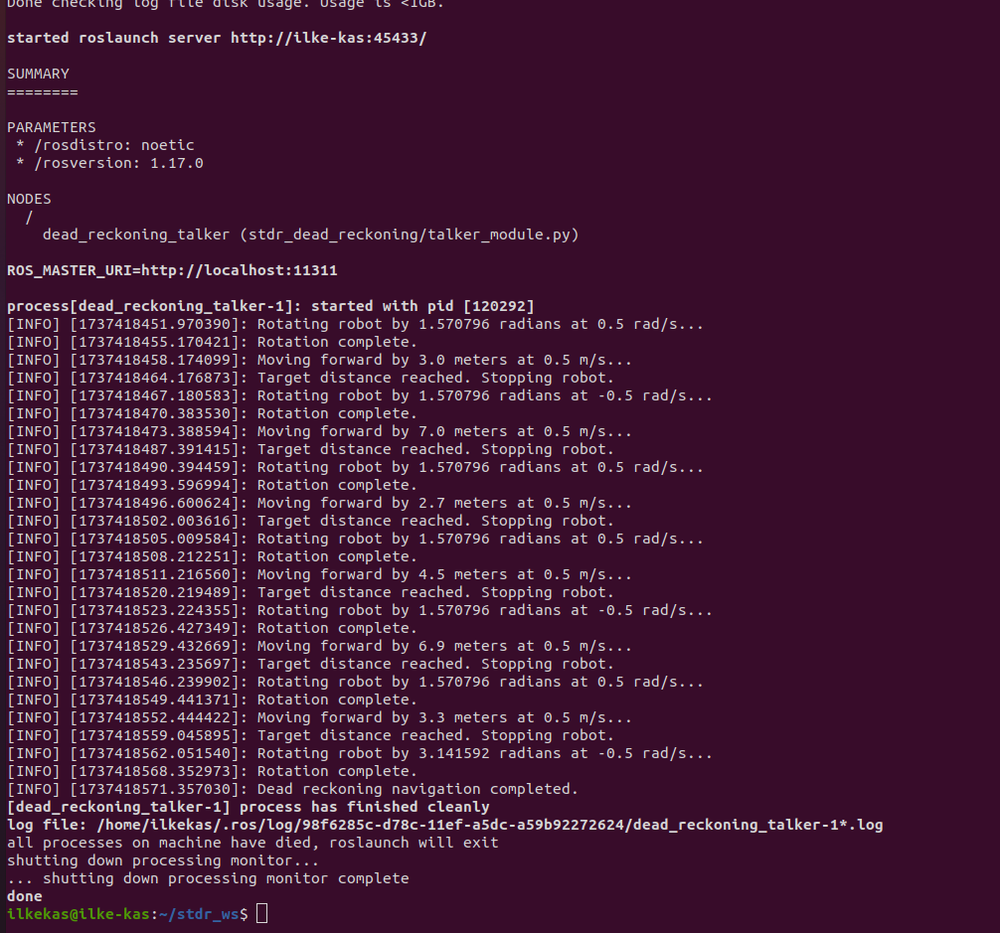

# Dead Reckoning Navigation
This repository contains the `stdr_dead_reckoning` package developed. The package is designed to move 2D robot  from where it is spawned at (1, 2, 0) to (1, 14, 0) without hitting the walls.

---

> **Note:** This package is intended for ROS Noetic on Ubuntu Focal. It is recommended to have basic knowledge of ROS nodes, services, and tf transformations to use this package effectively.

---
## Table of Contents

1. [Package Structure](#package-structure)
2. [Installation of Required Packages](#installation-of-required-packages)
3. [Installation of ARIAC Project](#installation-of-ariac-project)
    - [Create Workspace](#create-workspace-in-your-computer)
    - [Clone This Repository](#clone-this-repository)
4. [Launching the Package](#launching-the-package)
5. [Interpreting the Output](#interpreting-the-output)
    - [Video for Running Experiment](#video-for-running-experiment)
6. [Links and Resources](#links-and-resources)


---
## Package Structure
```
  stdr_dead_reckoning
  ├── CMakeLists.txt
  ├── package.xml
  ├── launch
  │   ├── dead_reckoning.launch
  │   └──stdr_dead_reckoning_with_robot.launch 
  ├── scripts
  │   └──talker
  ├── src
  │   └──stdr_dead_reckoning
  │      └──talker_module.py
  └── README.md
```
## Installation of Required Packages

To use this package, ensure the following dependencies are installed:

Retrieve and prepare the STDR for building.
Make a catkin workspace and make it the current working directory.

```bash
mkdir ‐p ~/stdr_ws/src
cd ~/stdr_ws/src
```
Clone the STDR repository from GitHub (Noetic is the default branch).

```bash
git clone ‐b noetic-devel / https://github.com/cwru‐ecse‐376/stdr_simulator.git
```
Prepare to make the packages
Change to the base of the catkin workspace.

```bash
cd ../
```
Configure to use ROS manually

```bash
source /opt/ros/noetic/setup.bash
```

Ensure all the dependencies are installed.

```bash
rosdep install -‐from‐paths src ‐i ‐y ‐r
```

Build the packages

```bash
catkin_make
```
Add the newly built packages to the environment

```bash
source devel/setup.bash
```

Start the STDR to test the installation.

```bash
roslaunch stdr_launchers server_with_map_and_gui_plus_robot
```
### Clone this repository under src of the stdr_ws workspace

```bash
    git clone https://github.com/cwru-courses/ecse_476_s25_ixk238_stdr_dead_reckoning.git
```

- Compile the workspace

```bash
    catkin_make
```

- Run workspace configuration to be used by ROS

```bash
    source devel/setup.bash
```

## Launching the Package

- **Launch the Dead Reckoning Navigation by using dead_reckoning.launch file :**

  Firstly, run the server_with_map_and_gui_plus_robot.launch in the background

```bash
  roslaunch stdr_launchers server_with_map_and_gui_plus_robot.launch&
  ```

  Then, run the dead_reckoning.launch file

```bash
 roslaunch stdr_dead_reckoning dead_reckoning.launch
  ```

  These two lines will open the simulator run both server_with_map_and_gui_plus_robot node and dead_reckoning_talker node installed previously.

- **Launch the Dead Reckoning Navigation by using dead_reckoning.launch file :**

```bash
 roslaunch stdr_dead_reckoning stdr_dead_reckoning_with_robot.launch
  ```
  This one line will open the simulator run both server_with_map_and_gui_plus_robot node and dead_reckoning_talker node installed previously. 

## Interpreting the Output
### Terminal Outputs and Observations
- When you run the roslaunch file, you will the output in the following Figure:

- As seen in the above terminal image, there is no error and the file can be launched correctly. We can see that the robot moved by set of instructions by using two main functions which publish Twist to cmd_vel topic. One of these functions is "move_forward". It sets the x axis of the linear velocity while "rotate_robot" sets the z axis of the angular velocity of the robot. In this way, robot moves to the requested position (1,14,0) approximaetly. The output lines "Rotating robot by ... radians at ... rad/s.." and "Moving forward by ... meters at ... m/s..." indicates that these functions are running, accordingly. 

## Video for Running Experiment


https://github.com/user-attachments/assets/70ec7611-27b8-4ba4-98f6-7edccfcbb48a


## Links and Resources
- [CWRU ECSE 476 Course Page](https://cwru-ecse-376.github.io/)
